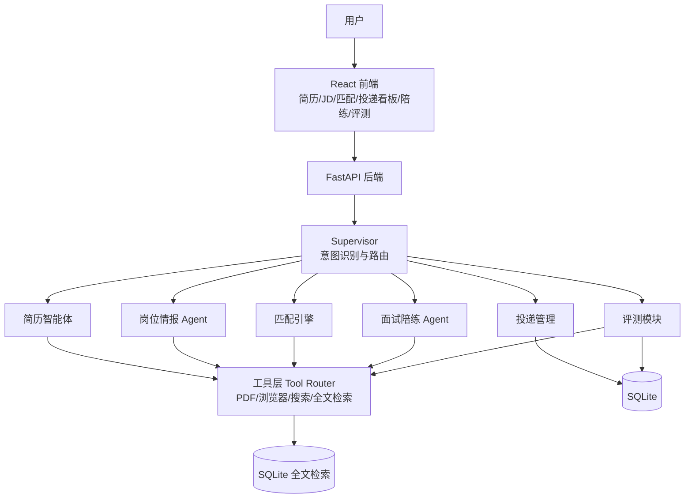

# Job Copilot

一站式求职 Agent：简历结构化 → JD 录入 → 匹配打分 → 自荐信 → 投递管理 → 面试陪练 → 评测回归。

## 架构



## 功能

- 简历 PDF 解析与 LLM 结构化（人工确认后入库）
- JD 多来源录入（粘贴文本 / URL 抓取 / 批量导入）
- 四维可解释匹配打分 + 差距分析（LangGraph 工作流）
- 自荐信生成 + LLM-as-judge 自检重写
- 投递状态机（非法跳转拦截 / 跟进建议 / 提醒）
- 企业研究（网页搜索 + LLM 报告）
- 市场洞察（技能频次 / 薪资统计 / 城市与公司分布）
- 面试陪练（按 JD + 简历定制的多轮模拟面试与 STAR 反馈）
- 评测平台（golden set / LLM-as-judge / 回归通过率 / 可视化报告）
- Supervisor 意图识别与助手入口
- SSE 实时匹配进度

## 快速开始

### 后端

```bash
cp .env.example .env   # 填入 LLM_API_KEY（可选 SEARCH_API_KEY）
pip install -r requirements.txt
uvicorn app.main:app --reload --port 8000
```

### 前端（开发模式）

```bash
cd app/web
npm install
npm run dev            # http://localhost:5173，/api 自动代理到 8000
```

### Docker（一键）

```bash
cp .env.example .env
docker compose up --build
```

或使用脚本：`powershell -File scripts/start.ps1`

### Demo 一键脚本

```bash
powershell -File scripts/demo.ps1   # 构建前端 + 启动后端 + 打开浏览器
```

## 环境变量

| 变量 | 必填 | 说明 |
|------|------|------|
| `LLM_API_KEY` | 是 | LLM 服务 Key |
| `LLM_BASE_URL` | 否 | 默认 OpenAI |
| `LLM_MODEL` | 否 | 默认 gpt-4o-mini |
| `SEARCH_API_KEY` | 否 | Tavily Key；未配置时企业研究降级为纯 LLM |
| `SEARCH_PROVIDER` | 否 | 默认 tavily |
| `DATABASE_URL` | 否 | SQLite 路径 |
| `SEARCH_DB_PATH` | 否 | 检索索引路径（SQLite） |
| `UPLOAD_DIR` | 否 | 上传目录 |

## 项目结构

```
app/
├── agents/        # 简历/JD/Supervisor/研究提示词
├── eval/          # 评测：golden 同步 / judge / runner
├── services/      # 业务编排：简历/JD/匹配/自荐信/投递/陪练/研究/洞察
├── tools/         # PDF/URL/搜索/工具路由
├── workflow/      # LangGraph 匹配工作流
├── web/           # React 前端
└── main.py        # FastAPI 入口
```

## 测试

```bash
pytest tests/ -v
pytest tests/ --cov=app --cov-report=term-missing
```

## 评测

1. 编辑 `data/golden_set.json`（替换示例 ID 为真实数据）。
2. 前端「系统自检」页：同步 golden set → 运行自检 → 查看通过率与趋势。
3. 基线记录见 `docs/eval-baseline.md`，改动合入前不得低于基线。

## 文档

- 调研与评审报告：`docs/audit-report-2026-08.md`
- Demo 讲解稿：`docs/demo-script.md`
- 简历项目描述：`docs/RESUME_BULLETS.md`
- 面试问答准备：`docs/INTERVIEW_PREP.md`
