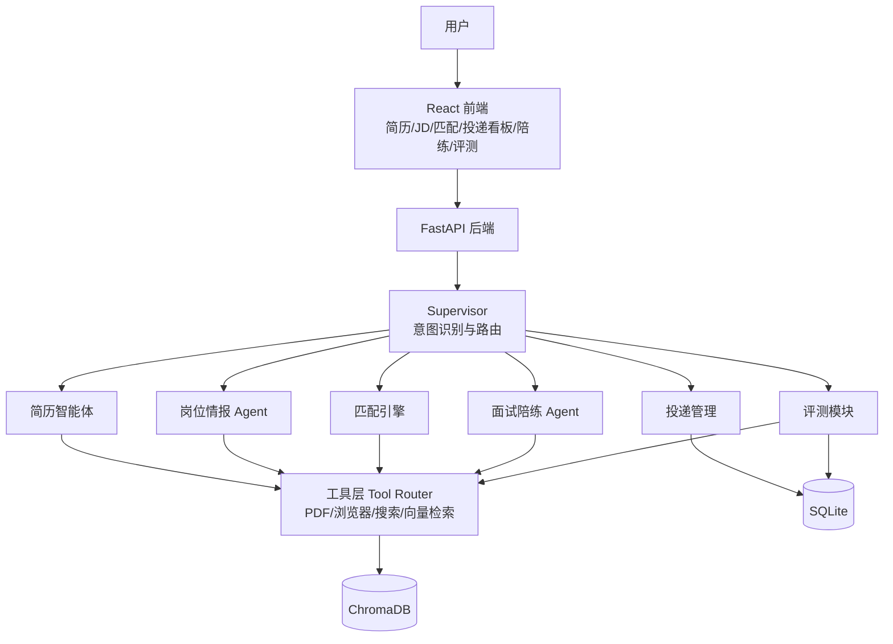

# Job Copilot · Phase 4（打磨与交付）实现计划

> **For agentic workers:** REQUIRED SUB-SKILL: Use superpowers:subagent-driven-development (recommended) or superpowers:executing-plans to implement this plan task-by-task. Steps use checkbox (`- [ ]`) syntax for tracking.

**Goal:** 把 Job Copilot 从「能跑」打磨到「能讲」：前端体验统一、README/Demo/部署固化、评测基线固化、简历项目描述与面试问答准备，让项目成为求职面试的完整弹药库。

**Architecture:** 本阶段无新功能，全部是打磨与交付物：ErrorBoundary 与错误提示统一；README 补齐架构图与环境变量表；`docs/` 沉淀 demo 讲解稿、评测基线、简历描述、面试问答四份文档；`scripts/` 提供一键 Demo 与启停脚本；docker-compose 增加健康检查。

**Tech Stack:** React 18 / Docker Compose / PowerShell 脚本 / Markdown 文档。

**前置条件:** Phase 1–3 已按对应计划完成并全部测试通过。

**项目根目录:** `job-copilot/`。所有相对路径均相对于该目录。

---

## 文件结构总览（Phase 4 新增/修改）

```
job-copilot/
├── README.md                        # 修改：完整版（架构图/目录/环境变量/截图区）
├── docker-compose.yml               # 修改：+ healthcheck
├── .env.production.example          # 新增：生产环境变量样例
├── docs/
│   ├── demo-script.md               # 新增：Demo 讲解稿
│   ├── eval-baseline.md             # 新增：评测基线记录
│   ├── RESUME_BULLETS.md            # 新增：简历项目描述（三档长度 + STAR）
│   └── INTERVIEW_PREP.md            # 新增：面试问答准备
├── scripts/
│   ├── demo.ps1                     # 新增：一键 Demo（构建前端 + 启动后端 + 打开浏览器）
│   ├── start.ps1                    # 新增：Docker 启动
│   └── stop.ps1                     # 新增：Docker 停止
└── app/web/src/
    ├── components/ErrorBoundary.jsx # 新增：前端错误边界
    └── App.jsx                      # 修改：包一层 ErrorBoundary
```

---

## Milestone A：体验与文档

### Task 1: 前端体验统一（ErrorBoundary）

**Files:**
- Create: `app/web/src/components/ErrorBoundary.jsx`
- Modify: `app/web/src/App.jsx`

- [ ] **Step 1: 创建 `app/web/src/components/ErrorBoundary.jsx`**

```jsx
import { Component } from 'react'

export default class ErrorBoundary extends Component {
  constructor(props) {
    super(props)
    this.state = { hasError: false, message: '' }
  }

  static getDerivedStateFromError(error) {
    return { hasError: true, message: error.message }
  }

  render() {
    if (this.state.hasError) {
      return (
        <div className="bg-red-50 border border-red-200 rounded-lg p-4 text-sm text-red-700">
          <div className="font-semibold mb-1">页面出错了</div>
          <p>{this.state.message}</p>
          <button
            onClick={() => this.setState({ hasError: false, message: '' })}
            className="mt-2 px-3 py-1 bg-red-600 text-white rounded"
          >
            重试
          </button>
        </div>
      )
    }
    return this.props.children
  }
}
```

- [ ] **Step 2: 修改 `app/web/src/App.jsx`（包一层错误边界）**

```jsx
import ErrorBoundary from './components/ErrorBoundary.jsx'
```

并把 `<main>` 内部改为：

```jsx
<main className="p-6 max-w-4xl">
  <ErrorBoundary>
    <ActiveComponent
      resumeId={resumeId}
      jdIds={jdIds}
      onResumeReady={handleResumeReady}
      onJDAdded={handleJDAdded}
    />
  </ErrorBoundary>
</main>
```

- [ ] **Step 3: 构建验证**

Run: `cd app/web && npm run build`
Expected: 构建成功

- [ ] **Step 4: 提交**

```bash
git add app/web/src/components/ErrorBoundary.jsx app/web/src/App.jsx
git commit -m "feat: 前端错误边界"
```

### Task 2: README 完整版

**Files:**
- Modify: `README.md`（整体替换）

- [ ] **Step 1: 整体替换 `README.md`**

```markdown
# Job Copilot

一站式求职 Agent：简历结构化 → JD 录入 → 匹配打分 → 自荐信 → 投递管理 → 面试陪练 → 评测回归。

## 架构



## 功能

- 简历 PDF 解析与 LLM 结构化（人工确认后入库）
- JD 多来源录入（粘贴文本 / URL 抓取 / 批量导入）
- 四维可解释匹配打分 + 差距分析（LangGraph 工作流）
- 自荐信生成 + LLM-as-judge 自检重写
- 投递状态机（非法跳转拦截 / 跟进建议 / 提醒）
- 企业研究（网页搜索 + LLM 报告）
- 市场洞察（技能频次 / 薪资统计 / 城市与公司分布）
- 面试陪练（按 JD + 简历定制的多轮模拟面试与 STAR 反馈）
- 评测平台（golden set / LLM-as-judge / 回归通过率 / 可视化报告）
- Supervisor 意图识别与助手入口
- SSE 实时匹配进度

## 快速开始

### 后端

```bash
cp .env.example .env   # 填入 LLM_API_KEY（可选 SEARCH_API_KEY）
pip install -r requirements.txt
uvicorn app.main:app --reload --port 8000
```

### 前端（开发模式）

```bash
cd app/web
npm install
npm run dev            # http://localhost:5173，/api 自动代理到 8000
```

### Docker（一键）

```bash
cp .env.example .env
docker compose up --build
```

或使用脚本：`powershell -File scripts/start.ps1`

### Demo 一键脚本

```bash
powershell -File scripts/demo.ps1   # 构建前端 + 启动后端 + 打开浏览器
```

## 环境变量

| 变量 | 必填 | 说明 |
|------|------|------|
| `LLM_API_KEY` | 是 | LLM 服务 Key |
| `LLM_BASE_URL` | 否 | 默认 OpenAI |
| `LLM_MODEL` | 否 | 默认 gpt-4o-mini |
| `SEARCH_API_KEY` | 否 | Tavily Key；未配置时企业研究降级为纯 LLM |
| `SEARCH_PROVIDER` | 否 | 默认 tavily |
| `DATABASE_URL` | 否 | SQLite 路径 |
| `CHROMA_PATH` | 否 | 向量库路径 |
| `UPLOAD_DIR` | 否 | 上传目录 |

## 项目结构

```
app/
├── agents/        # 简历/JD/Supervisor/研究提示词
├── eval/          # 评测：golden 同步 / judge / runner
├── services/      # 业务编排：简历/JD/匹配/自荐信/投递/陪练/研究/洞察
├── tools/         # PDF/URL/搜索/工具路由
├── workflow/      # LangGraph 匹配工作流
├── web/           # React 前端
└── main.py        # FastAPI 入口
```

## 测试

```bash
pytest tests/ -v
pytest tests/ --cov=app --cov-report=term-missing
```

## 评测

1. 编辑 `data/golden_set.json`（替换示例 ID 为真实数据）。
2. 前端「评测报告」页：同步 golden set → 运行评测 → 查看通过率与趋势。
3. 基线记录见 `docs/eval-baseline.md`，改动合入前不得低于基线。

## 文档

- 设计文档：`docs/superpowers/specs/2026-08-04-job-copilot-design.md`
- Demo 讲解稿：`docs/demo-script.md`
- 简历项目描述：`docs/RESUME_BULLETS.md`
- 面试问答准备：`docs/INTERVIEW_PREP.md`
```

- [ ] **Step 2: 提交**

```bash
git add README.md
git commit -m "docs: README 完整版（架构/环境变量/结构/评测）"
```

### Task 3: Demo 讲解稿与一键脚本

**Files:**
- Create: `docs/demo-script.md`
- Create: `scripts/demo.ps1`

- [ ] **Step 1: 创建 `docs/demo-script.md`**

```markdown
# Job Copilot Demo 讲解稿（约 3 分钟）

## 开场（30 秒）

这是我做的求职全生命周期 Agent——从简历到 offer 的全流程助手。
它和我之前做的 DeepResearch-Agent 互补：那个是研究型（规划-检索-写作-质检），
这个是操作型 + 产品型，补齐了真实工具调用、人机协同边界和评测闭环。

## 主闭环（90 秒）

1. 上传简历 PDF → 展示 LLM 结构化结果 → 人工确认后入库
   （强调：解析不可能 100% 准，人机协同是刻意设计，不是妥协）。
2. 批量粘贴两条 JD → 展示结构化 → 生成市场洞察
   （技能频次 / 薪资统计 / 城市与公司分布）。
3. 发起匹配 → SSE 实时进度 → 四维分数 + 差距分析
   （skill/experience/education/hard requirements，每维附理由）。
4. 生成自荐信 → 展示 judge 评分，不达标自动重写一轮。

## 差异化（60 秒）

5. 投递看板：状态流转、非法跳转被拦截（422）、跟进建议。
6. 面试陪练：一轮问答展示评分与 STAR 反馈，说明有状态会话。
7. 评测报告：跑 golden set，展示通过率；说明回归价值——「改动前先跑基线」。

## 收尾（30 秒）

- 技术栈一句话：FastAPI + LangGraph + ChromaDB + React，全部本地可跑（Docker 一键）。
- 三个可深挖的难点：
  1. 人机协同边界（Agent 不自动投递、解析强制确认）；
  2. 可解释打分（每维分数 + 理由，用户能看懂）；
  3. 评测防「judge 自欺」（golden set 人工标注 + 抽样复核 + 回归门槛）。
```

- [ ] **Step 2: 创建 `scripts/demo.ps1`**

```powershell
# Job Copilot 一键 Demo：构建前端 + 启动后端 + 打开浏览器
$ErrorActionPreference = "Stop"
$root = Split-Path -Parent $PSScriptRoot
Set-Location $root

if (-not (Test-Path ".env")) {
  Copy-Item ".env.example" ".env"
  Write-Host "已生成 .env，请先填入 LLM_API_KEY 后重新运行本脚本"
  exit 1
}

Write-Host "==> 构建前端"
Push-Location "app/web"
npm install
npm run build
Pop-Location

Write-Host "==> 启动后端 http://localhost:8000"
Start-Process -FilePath "uvicorn" -ArgumentList "app.main:app --port 8000" -WorkingDirectory $root -WindowStyle Hidden
Start-Sleep -Seconds 3
Start-Process "http://localhost:8000"
```

- [ ] **Step 3: 验证脚本语法**

Run: `powershell -NoProfile -Command "Get-Content scripts/demo.ps1 | Out-Null; Write-Host OK"`
Expected: `OK`

- [ ] **Step 4: 提交**

```bash
git add docs/demo-script.md scripts/demo.ps1
git commit -m "docs: Demo 讲解稿与一键脚本"
```

### Task 4: 部署固化

**Files:**
- Modify: `docker-compose.yml`（+ healthcheck）
- Create: `.env.production.example`
- Create: `scripts/start.ps1`
- Create: `scripts/stop.ps1`

- [ ] **Step 1: 修改 `docker-compose.yml`（追加 healthcheck）**

```yaml
services:
  app:
    build: .
    ports:
      - "8000:8000"
    env_file:
      - .env
    volumes:
      - ./data:/app/data
    healthcheck:
      test: ["CMD", "python", "-c", "import urllib.request;urllib.request.urlopen('http://localhost:8000/health')"]
      interval: 10s
      timeout: 5s
      retries: 5
```

- [ ] **Step 2: 创建 `.env.production.example`**

```bash
LLM_API_KEY=
LLM_BASE_URL=https://api.openai.com/v1
LLM_MODEL=gpt-4o-mini
SEARCH_API_KEY=
SEARCH_PROVIDER=tavily
DATABASE_URL=sqlite:///./data/job_copilot.db
CHROMA_PATH=./data/chroma
UPLOAD_DIR=./data/uploads
```

- [ ] **Step 3: 创建 `scripts/start.ps1`**

```powershell
# Docker 一键启动
$ErrorActionPreference = "Stop"
$root = Split-Path -Parent $PSScriptRoot
Set-Location $root
docker compose up --build -d
Write-Host "启动完成：http://localhost:8000"
```

- [ ] **Step 4: 创建 `scripts/stop.ps1`**

```powershell
# Docker 停止
$ErrorActionPreference = "Stop"
$root = Split-Path -Parent $PSScriptRoot
Set-Location $root
docker compose down
```

- [ ] **Step 5: 验证**

Run: `docker compose config`
Expected: 配置合法，healthcheck 出现在输出中

- [ ] **Step 6: 提交**

```bash
git add docker-compose.yml .env.production.example scripts/start.ps1 scripts/stop.ps1
git commit -m "chore: 部署固化（healthcheck/启停脚本/生产配置）"
```

### Task 5: 评测基线固化

**Files:**
- Create: `docs/eval-baseline.md`
- Modify: `README.md`（引用基线文档，README 已含引用，无需改动则可跳过）

- [ ] **Step 1: 创建 `docs/eval-baseline.md`**

```markdown
# 评测基线

> 原则：任何改动合入前，golden set 核心指标不得低于下表基线。

## 基线记录

| 日期 | run_id | 通过率 | match 平均分 | cover_letter 平均分 | interview 平均分 | 备注 |
|------|--------|--------|-------------|---------------------|------------------|------|
| 2026-08-04 | （运行后填入） | 1.0 | 83.0 | 0.9 | 82.0 | 首次基线 |

## 使用说明

1. 启动系统，在「评测报告」页点「运行评测」（或 `POST /api/eval/runs`）。
2. 把返回的 `run_id`、通过率与分类型平均分填入上表。
3. 每次功能改动后重跑评测：若通过率低于基线，先修复再合入。
4. 基线调整必须说明理由（如 golden set 扩充、judge 标准收紧）。
```

- [ ] **Step 2: 验证 golden set 模板与基线字段对应**

Run: `Select-String -Path data/golden_set.json -Pattern 'match-example|cover-letter-example|interview-example'`
Expected: 三个用例模板都存在，与基线三列对应

- [ ] **Step 3: 提交**

```bash
git add docs/eval-baseline.md
git commit -m "docs: 评测基线记录"
```

---

## Milestone B：求职弹药库

### Task 6: 简历项目描述

**Files:**
- Create: `docs/RESUME_BULLETS.md`

- [ ] **Step 1: 创建 `docs/RESUME_BULLETS.md`**

```markdown
# 简历项目描述（Job Copilot）

## 一句话（80 字内）

基于 LangGraph 的求职全生命周期 Agent：简历结构化、JD 四维匹配打分、自荐信生成、
投递状态管理、面试陪练，内置 golden set 评测回归。

## 150 字版

Job Copilot 是一站式求职 Agent（FastAPI + LangGraph + ChromaDB + React）。
简历 PDF 经 LLM 结构化并人工确认后入库；JD 支持文本/URL/批量导入，可生成市场洞察；
匹配引擎按技能/经历/教育/硬性条件四维可解释打分并输出差距建议；自荐信由
LLM-as-judge 自检重写；投递看板实现状态机校验与跟进提醒；面试陪练按 JD + 简历
进行多轮模拟并给 STAR 反馈。全部过程 SSE 实时可见。

## 300 字版

Job Copilot 是我独立开发的求职全生命周期 Agent，覆盖「简历 → JD → 匹配 → 自荐信 →
投递 → 面试 → 评测」完整闭环。

工程上：FastAPI + LangGraph + ChromaDB + SQLite + React。简历 PDF 解析后由 LLM
按 Pydantic schema 结构化，强制人工确认点保证数据质量；JD 支持粘贴、URL、批量三种
来源，聚合生成技能频次/薪资/城市洞察。匹配引擎是 LangGraph 三步工作流（规则关键词
重叠 → LLM 四维打分 → 差距归一化），每维分数附可读理由。

产品与工程判断：自荐信内置 LLM-as-judge 评审，不达标自动重写一轮；投递状态机拦截
非法跳转并按等待天数给出跟进建议；面试陪练为有状态多轮会话，按 JD 和简历定制提问，
输出 STAR 反馈与总结；Agent 不自动投递，最终动作留给用户，这是刻意的人机协同边界。

质量保障：构建了 golden set 评测体系——人工标注期望结果、LLM-as-judge 打分、
回归通过率看板，任何改动先跑基线再合入，解决「怎么证明 Agent 变好了」的问题。

## STAR 故事

### 故事一：评测体系（推荐必讲）
- 情境：项目功能多了之后，无法判断改动是否让匹配/自荐信变好。
- 任务：建立可量化的质量闭环。
- 行动：准备 golden set（人工标注期望区间与关键词），实现三类判定
  （match 区间判定 / cover_letter LLM-as-judge / interview 阈值判定），
  聚合通过率与分类型平均分，前端可视化历史趋势。
- 结果：任何改动先跑评测，回归通过率成为合入门槛，面试时能现场演示。

### 故事二：可解释匹配
- 情境：黑盒打分用户不信任。
- 任务：让用户看懂为什么匹配。
- 行动：拆成技能/经历/教育/硬性条件四维，每维附一句理由；规则层关键词重叠
  作为信号喂给 LLM，避免纯凭感觉。
- 结果：结果页直接展示分维度分数与差距清单，用户可复核。

### 故事三：人机协同边界
- 情境：浏览器自动化/LLM 输出都有不确定性。
- 任务：设计系统边界，让 Agent 可靠且不越权。
- 行动：简历结构化强制人工确认；投递动作只记录不代投；
  降级事件全部写日志并展示。
- 结果：系统出错不静默、不越权，面试官问「遇到问题怎么办」有真实案例。
```

- [ ] **Step 2: 提交**

```bash
git add docs/RESUME_BULLETS.md
git commit -m "docs: 简历项目描述（三档长度 + STAR）"
```

### Task 7: 面试问答准备

**Files:**
- Create: `docs/INTERVIEW_PREP.md`

- [ ] **Step 1: 创建 `docs/INTERVIEW_PREP.md`**

```markdown
# 面试问答准备（Job Copilot）

## 1. 为什么用 LangGraph 而不是 LangChain Agent / CrewAI？

需要可控的有状态工作流：规则节点（关键词重叠）→ LLM 打分 → 差距归一化，节点边界
清晰、可单测；LangGraph 的显式图结构让「每一步做了什么」可观测，配合 SSE 展示执行
轨迹，面试演示直观。CrewAI 偏高层封装，灵活性不足；LangChain Agent 的隐式循环
不利于错误定位。

## 2. 怎么证明你的 Agent 变好了？

golden set 评测：人工标注期望结果（匹配分数区间、自荐信关键词、陪练总结阈值），
三类判定器分别用确定性区间、LLM-as-judge、阈值判定；跑完聚合通过率与分类型平均分。
任何改动先跑评测，指标不低于基线才合入，防止「修 A 坏 B」。

## 3. LLM-as-judge 会不会自欺？

会，所以有三道防线：golden set 期望由人工标注；judge 只负责给分，不参与生成；
设计上保留人工抽样复核（每周抽 10% 复核校准），且 judge 与生成用同一模型时
会在报告中标注风险。现阶段 judge 用于自检重写循环，最终裁决仍是人工。

## 4. 简历解析不准怎么办？

两条路：解析后强制人工确认点，未确认不入库；解析失败降级为纯文本 + 提示改用
粘贴输入。PDF 扫描件走 OCR 开关（可选增强）。人机协同是刻意设计：LLM 擅长结构化
提取，人负责最终确认。

## 5. 匹配分数可解释吗？怎么做的？

四维拆解：skill_match / experience_match / education_match / hard_requirements，
每维 0-100 并附一句理由；规则层先算关键词重叠率作为信号喂给 LLM，避免纯黑盒。
权重可配置，总分 = 加权和，前端雷达图展示。

## 6. 反爬/合规怎么办？

JD 来源以用户提供为主（粘贴/上传/URL），浏览器自动化仅限公开页面，不做登录态
爬取；失败时降级提示手动粘贴。Agent 不自动投递，最终动作留给用户，规避合规与
稳定性风险。

## 7. SSE 实时展示怎么实现的？

进程内线程安全事件总线：后台线程跑匹配任务并 publish 事件，SSE 生成器订阅队列，
用 `asyncio.to_thread(queue.get)` 轮询；事件类型包括 started / match_progress /
match_result / completed / error，前端 EventSource 按类型消费。

## 8. 状态机怎么防非法跳转？

默认转移表定义合法路径（applied→screening→interview→offer→accepted/rejected，
含退回边），每单可注册自定义状态及其下一步；目标状态不在 allowed_next 集合即
抛 ValueError，API 层转 422 并提示合法路径。

## 9. 多 Agent 之间怎么通信？

服务层编排为主（简历/JD/匹配/自荐信是串行管道），Supervisor 做意图分类与路由；
评测 runner 复用各服务，把 golden case 逐条跑出指标。通信通过 SQLAlchemy 共享
状态与 Pydantic 结构化结果，避免 Agent 间直接耦合。

## 10. 项目最大的坑是什么？

LLM 结构化输出不稳定（非 JSON/字段缺失）：解法是 Pydantic schema 校验 + 带错误
信息重试一次 + 纯文本降级；另一个坑是 ChromaDB 默认嵌入模型要联网下载，测试用
确定性哈希嵌入替代，保证 CI 离线可跑。
```

- [ ] **Step 2: 提交**

```bash
git add docs/INTERVIEW_PREP.md
git commit -m "docs: 面试问答准备"
```

### Task 8: 最终验收清单

**Files:** 无（人工验收）

- [ ] **Step 1: 全量回归 + 覆盖率**

Run: `pytest tests/ --cov=app --cov-report=term-missing`
Expected: 全部通过，核心逻辑覆盖率 85%+

- [ ] **Step 2: 一键 Demo 走查**

Run: `powershell -File scripts/demo.ps1`
Expected: 前端构建成功 → 后端启动 → 浏览器自动打开首页

- [ ] **Step 3: 主闭环 + 差异化全走查**

1. 上传简历 → 确认 → 批量录入 JD → 洞察 → 匹配（SSE）→ 自荐信。
2. 记录投递 → 状态流转 → 非法跳转被拦截 → 跟进建议。
3. 面试陪练 5 轮 → 总结生成。
4. 评测：同步 golden set → 运行 → 通过率报告 → 基线记录到 `docs/eval-baseline.md`。
5. 助手页：market_insight 意图直接出报告。

Expected: 5 条全部可完成，无报错。

- [ ] **Step 4: Docker 生产模式走查**

Run: `powershell -File scripts/start.ps1` → `docker compose ps`
Expected: 容器 healthy，`http://localhost:8000` 可访问

- [ ] **Step 5: 交付物核对**

Run: `Get-ChildItem docs, scripts -Recurse | Select-Object FullName`
Expected: `demo-script.md` / `eval-baseline.md` / `RESUME_BULLETS.md` / `INTERVIEW_PREP.md` /
`demo.ps1` / `start.ps1` / `stop.ps1` 全部存在

- [ ] **Step 6: 收尾提交（如有修复）**

```bash
git add -A
git commit -m "fix: Phase 4 验收修复"
```

---

## 自检记录

### 1. Spec 覆盖

| 设计文档要求 | 对应任务 |
|------------|---------|
| 前端体验打磨、错误提示完善 | Task 1（ErrorBoundary） |
| README、架构图、Demo 视频 | Task 2（架构图）、Task 3（讲解稿 + 一键脚本） |
| 部署脚本与评测基线固化 | Task 4、Task 5 |
| 简历项目描述 + 面试问答准备 | Task 6、Task 7 |
| 验收：README 完整 / 一键启动 / Demo 可录屏 / 面试故事讲得清 | Task 8 |

### 2. 占位符扫描

已全文扫描：无 TBD / TODO / 「后续实现」等占位。`docs/eval-baseline.md` 中的
`run_id` 与指标是运行时填写字段，README 与文档已给出明确填写步骤。

### 3. 一致性

- 文档路径（`docs/demo-script.md` 等）与 README「文档」小节引用一致。
- 脚本路径（`scripts/demo.ps1` 等）与 README 命令一致。
- 评测基线的三列（match / cover_letter / interview）与 Phase 3 的三种 task_type 一致。
- docker-compose healthcheck 与 `/health` 端点一致。
